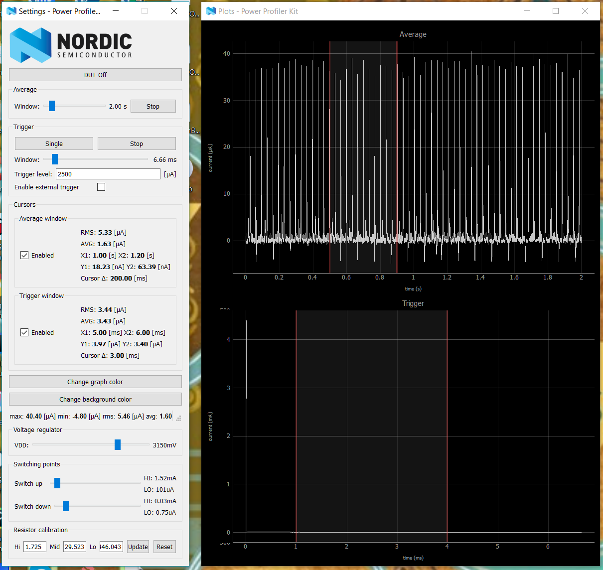

# mbed-power-profiling
This repository holds code used to profile power usage with mbed OS and Nordic nRF5. It came from some experimentation that was needed to figure out how to reduce power consumption to the bare minimum on a Nordic Semiconductors nRF52-DK.

# Compile Flags

| Current Consumption | Compiler Command |
| --- | --- |
| 6mA | `mbed compile -c` |
| 450uA | `mbed compile -c --profile release -DENABLE_SLEEP` |
| 1.6 - 5uA | `mbed compile -c --profile release -DENABLE_SLEEP -DDISABLE_PRINTF` |

# Power Profiling

# References

* https://docs.mbed.com/docs/mbed-os-handbook/en/latest/dev_tools/build_profiles/
* https://github.com/ARMmbed/mbed-os/issues/3509
* https://vilimpoc.org/blog/2017/04/24/power-profiling-on-mbed-nordic-nrf5-series/
